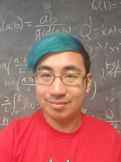

---
# Feel free to add content and custom Front Matter to this file.
# To modify the layout, see https://jekyllrb.com/docs/themes/#overriding-theme-defaults

layout: page
---

I am a Research Visiting Assistant Professor in the 
[Department of Mathematics](https://math.osu.edu/)
at the Ohio State University. My research main research area is
pure and applied harmonic analysis. In particular, I study frame theory,
optimal line packings, compressive sensing, with applications to areas such
as data science as well as signal and image processing. Here is a link to my
[CV]({{site.url}}/mmagsino_cv.pdf). (Last updated: 10/13/19)

I received my PhD in 2018 at the 
[University of Maryland](https://www-math.umd.edu/)
under the guidance of 
[John J. Benedetto](https://www.math.umd.edu/~jjb/). I spent my undergraduate
years at 
[Carnegie Mellon University](https://www.cmu.edu/math/index.html), where I
graduated in 2012 with a BS in Mathematics and Japanese Studies.

I am from Franklin Park, NJ, and I am 
[Filipino-American](http://fanhs-national.org/filam/). 
My mom is from
[Quezon City](https://en.wikipedia.org/wiki/Quezon_City) and my dad is from
[Makati](https://en.wikipedia.org/wiki/Makati); both are part of the
Metro Manila area. My main hobbies are anime
and gaming. If you are curious you can read more about it
[here]({{site.url}}/misc/).
